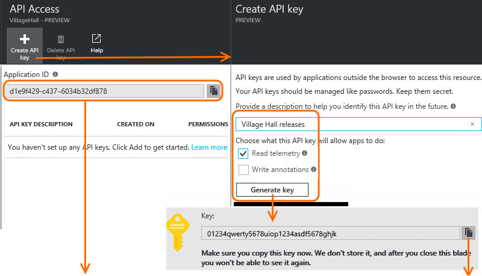

# Azure Application Insights	Integration for NeoLoad

## Overview

These Advanced Actions allows you to integrate with [Azure ](https://dev.applicationinsights.io) in order to correlate data from one tool to another.

This bundle provides inbound integration:
  
* **AzureMonitoring**   
    * **Azure Application Insights &rarr; NeoLoad**: Retrieves infrastructure and service metrics from Azure Applicaiton Insights and inserts them in NeoLoad External Data so that
      you can correlate NeoLoad and Azure Application Insights metrics within NeoLoad.

     
| Property | Value |
| -----| -------------- |
| Maturity | Stable |
| Author   | Neotys Partner Team |
| License  | [BSD Simplified](https://www.neotys.com/documents/legal/bsd-neotys.txt) |
| NeoLoad  | 6.+ (Enterprise or Professional Edition w/ Integration & Advanced Usage and NeoLoad Web option required)|
| Bundled in NeoLoad | No
| Download Binaries | <ul><li>[latest release](https://github.com/NeotysLab/Azureapplicationinsights/releases/latest) is only compatible with NeoLoad from version 7.0</li>|

## Installation

1. Download the [latest release](https://github.com/NeotysLab/Azureapplicationinsights/releases/latest) for NeoLoad from version 7.0 
1. Read the NeoLoad documentation to see [How to install a custom Advanced Action](https://www.neotys.com/documents/doc/neoload/latest/en/html/#25928.htm).

## NeoLoad Set-up

Once installed, how to use in a given NeoLoad project:

1. Create a “Azure Insights” User Path.
1. Insert "AzureMonitoring" in the ‘Actions’ block.
   

1. Configure "AzureMonitoring" by specifying your application ID and API KEY
   

1. Select the **Actions** container and set a pacing duration of 30 seconds.
1. Create a "PopulationAzure" Population that contains 100% of "AzureMonitoring" User Path.
   

1. In the **Runtime** section, select your scenario, select the "PopulationAzure" population and define a constant load of 1 user for the full duration of the load test.
   

1. Do not use multiple load generators. Good practice should be to keep only the local one.

## Azure Insights Set-up

You need the Application ID and an API Key to access Application Insights through the API. To get these two keys:
1. In Azure portal, open the Application Insights resource for your application and open Settings, API Access.
1. The Application ID is a unique, unchangeable identifier for this application.
1. Create a new API key, checking the "Read telemetry" box.
1. Copy the key before closing the Create API key blade and save it somewhere secure. (If you lose the key, you'll need to create another.)

## Parameters for Dynatrace Monitoring

Tip: Get NeoLoad API information in NeoLoad preferences: Project Preferences / REST API.

| Name             | Description |
| -----            | ----- |
| ApplicationId      | Identifier of your Azure Application Insights ID |
| AzureApiKey  | API key of your Azure application Insights account |
| dataExchangeApiUrl (Optional)  | Where the DataExchange server is located. Optional, by default it is: http://${NL-ControllerIp}:7400/DataExchange/v1/Service.svc/ |
| dataExchangeApiKey (Optional)  | API key of the DataExchange API |
| proxyName (Optional) |  The name of the NeoLoad proxy to access to Dynatrace |

## Check User Path

This bundle does not work with the Check User Path mode.
A Bad context error should be raised.

## Status Codes

* Azure monitoring
    * NL-AZURE MONITORING_ACTION-01: Could not parse arguments
    * NL-AZURE MONITORING_ACTION-02: Technical Error
    * NL-AZURE MONITORING_ACTION-03: Bad context
